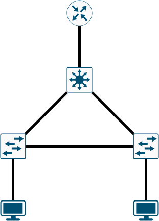
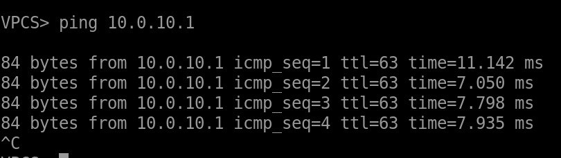
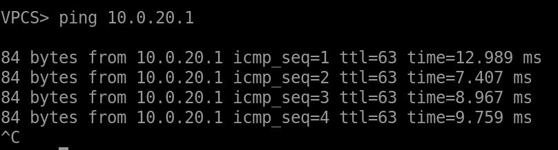
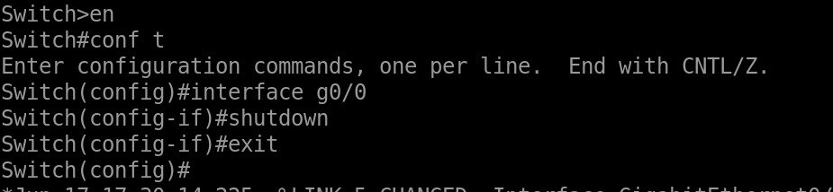
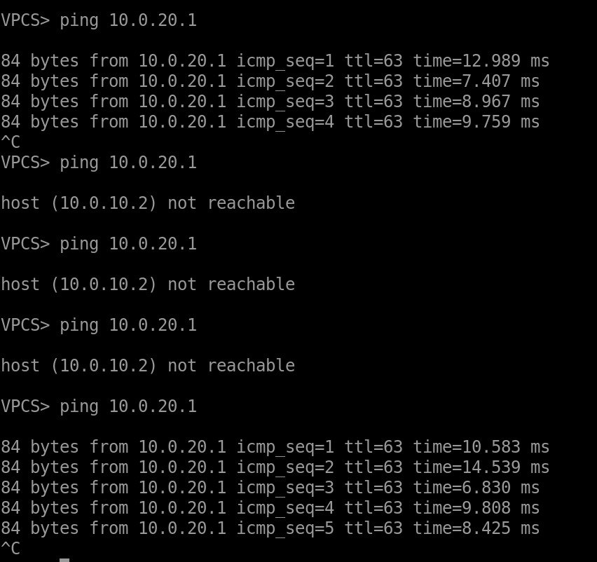

# Топология



## Доказательства того, что система работает:

## Работоспособность:




## STP:

### SwitchA:

```
Switch#show spanning-tree

VLAN0001
  Spanning tree enabled protocol ieee
  Root ID    Priority    32769
             Address     5000.0003.0000
             This bridge is the root
             Hello Time   2 sec  Max Age 20 sec  Forward Delay 15 sec

  Bridge ID  Priority    32769  (priority 32768 sys-id-ext 1)
             Address     5000.0003.0000
             Hello Time   2 sec  Max Age 20 sec  Forward Delay 15 sec
             Aging Time  300 sec

Interface           Role Sts Cost      Prio.Nbr Type
------------------- ---- --- --------- -------- --------------------------------
Gi0/3               Desg FWD 4         128.4    P2p 
Gi1/0               Desg FWD 4         128.5    P2p 
Gi1/1               Desg FWD 4         128.6    P2p 
Gi1/2               Desg FWD 4         128.7    P2p 
Gi1/3               Desg FWD 4         128.8    P2p

VLAN0010
  Spanning tree enabled protocol ieee
  Root ID    Priority    24586
             Address     5000.0002.0000
             Cost        4
             Port        1 (GigabitEthernet0/0)
             Hello Time   2 sec  Max Age 20 sec  Forward Delay 15 sec

  Bridge ID  Priority    32778  (priority 32768 sys-id-ext 10)
             Address     5000.0003.0000
             Hello Time   2 sec  Max Age 20 sec  Forward Delay 15 sec
             Aging Time  300 sec

Interface           Role Sts Cost      Prio.Nbr Type
------------------- ---- --- --------- -------- --------------------------------
Gi0/0               Root FWD 4         128.1    P2p 
Gi0/1               Desg FWD 4         128.2    P2p 
Gi0/2               Desg FWD 4         128.3    P2p

VLAN0020
  Spanning tree enabled protocol ieee
  Root ID    Priority    24596
             Address     5000.0002.0000
             Cost        4
             Port        1 (GigabitEthernet0/0)
             Hello Time   2 sec  Max Age 20 sec  Forward Delay 15 sec

  Bridge ID  Priority    32788  (priority 32768 sys-id-ext 20)
             Address     5000.0003.0000
             Hello Time   2 sec  Max Age 20 sec  Forward Delay 15 sec
             Aging Time  300 sec

Interface           Role Sts Cost      Prio.Nbr Type
------------------- ---- --- --------- -------- --------------------------------
Gi0/0               Root FWD 4         128.1    P2p 
Gi0/1               Desg FWD 4         128.2    P2p
```

### SwitchB:

```
Switch>show spanning-tree

VLAN0001
  Spanning tree enabled protocol ieee
  Root ID    Priority    32769
             Address     5000.0004.0000
             This bridge is the root
             Hello Time   2 sec  Max Age 20 sec  Forward Delay 15 sec

  Bridge ID  Priority    32769  (priority 32768 sys-id-ext 1)
             Address     5000.0004.0000
             Hello Time   2 sec  Max Age 20 sec  Forward Delay 15 sec
             Aging Time  300 sec

Interface           Role Sts Cost      Prio.Nbr Type
------------------- ---- --- --------- -------- --------------------------------
Gi0/3               Desg FWD 4         128.4    P2p 
Gi1/0               Desg FWD 4         128.5    P2p 
Gi1/1               Desg FWD 4         128.6    P2p 
Gi1/2               Desg FWD 4         128.7    P2p 
Gi1/3               Desg FWD 4         128.8    P2p


VLAN0010  
  Spanning tree enabled protocol ieee
  Root ID    Priority    24586
             Address     5000.0002.0000
             Cost        4
             Port        2 (GigabitEthernet0/1)
             Hello Time   2 sec  Max Age 20 sec  Forward Delay 15 sec
          
  Bridge ID  Priority    32778  (priority 32768 sys-id-ext 10)
             Address     5000.0004.0000
             Hello Time   2 sec  Max Age 20 sec  Forward Delay 15 sec
             Aging Time  300 sec
          
Interface           Role Sts Cost      Prio.Nbr Type
------------------- ---- --- --------- -------- --------------------------------
Gi0/0               Altn BLK 4         128.1    P2p 
Gi0/1               Root FWD 4         128.2    P2p 
          
          
          
VLAN0020
```

### Switch:

```
Switch>show spanning-tree

VLAN0001
  Spanning tree enabled protocol ieee
  Root ID    Priority    32769
             Address     5000.0002.0000
             This bridge is the root
             Hello Time   2 sec  Max Age 20 sec  Forward Delay 15 sec

  Bridge ID  Priority    32769  (priority 32768 sys-id-ext 1)
             Address     5000.0002.0000
             Hello Time   2 sec  Max Age 20 sec  Forward Delay 15 sec
             Aging Time  300 sec

Interface           Role Sts Cost      Prio.Nbr Type
------------------- ---- --- --------- -------- --------------------------------
Gi0/3               Desg FWD 4         128.4    P2p 
Gi1/0               Desg FWD 4         128.5    P2p 
Gi1/1               Desg FWD 4         128.6    P2p 
Gi1/2               Desg FWD 4         128.7    P2p 
Gi1/3               Desg FWD 4         128.8    P2p

VLAN0010  
  Spanning tree enabled protocol ieee
  Root ID    Priority    24586
             Address     5000.0002.0000
             This bridge is the root
             Hello Time   2 sec  Max Age 20 sec  Forward Delay 15 sec
          
  Bridge ID  Priority    24586  (priority 24576 sys-id-ext 10)
             Address     5000.0002.0000
             Hello Time   2 sec  Max Age 20 sec  Forward Delay 15 sec
             Aging Time  300 sec
          
Interface           Role Sts Cost      Prio.Nbr Type
------------------- ---- --- --------- -------- --------------------------------
Gi0/0               Desg FWD 4         128.1    P2p 
Gi0/1               Desg FWD 4         128.2    P2p 
Gi0/2               Desg FWD 4         128.3    P2p

VLAN0020  
  Spanning tree enabled protocol ieee
  Root ID    Priority    24596
             Address     5000.0002.0000
             This bridge is the root
             Hello Time   2 sec  Max Age 20 sec  Forward Delay 15 sec
          
  Bridge ID  Priority    24596  (priority 24576 sys-id-ext 20)
             Address     5000.0002.0000
             Hello Time   2 sec  Max Age 20 sec  Forward Delay 15 sec
             Aging Time  300 sec
          
Interface           Role Sts Cost      Prio.Nbr Type
------------------- ---- --- --------- -------- --------------------------------
Gi0/0               Desg FWD 4         128.1    P2p 
Gi0/1               Desg FWD 4         128.2    P2p 
Gi0/2               Desg FWD 4         128.3    P2p
```


## Проверка отказоустойчивости:

На Switch отлючаем g0/0:


Спустя время пинги продолжают присылаться:
